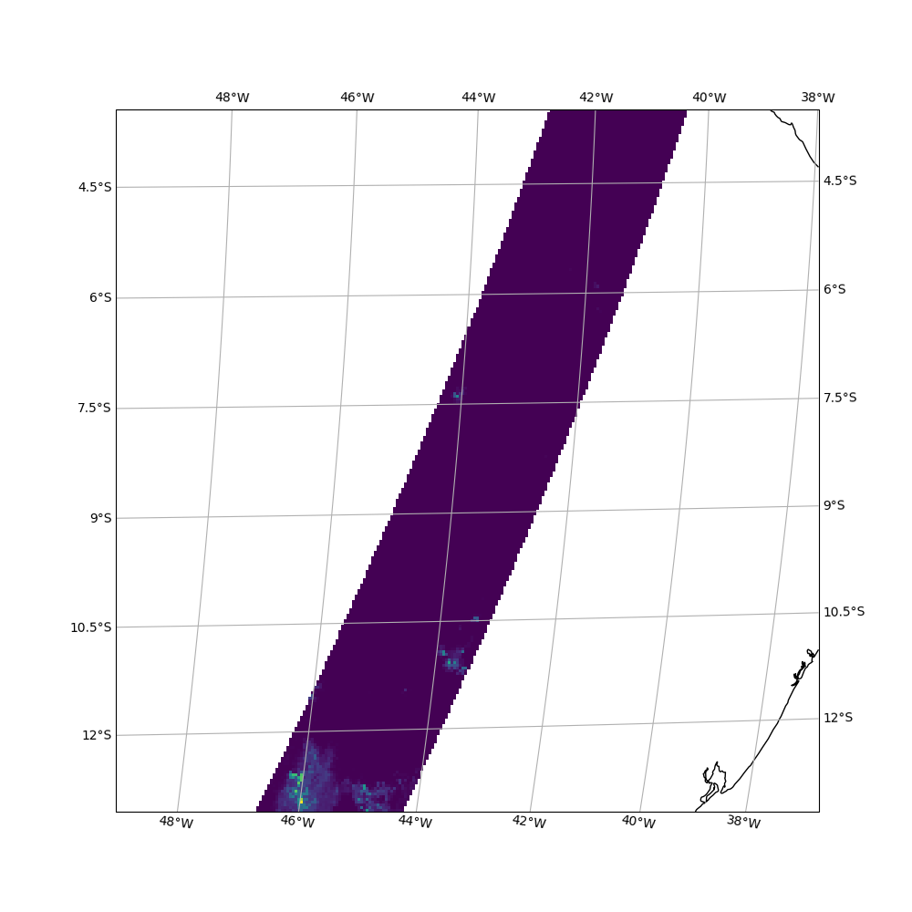

# Master's Thesis in Space, earth and environment
## Spring 2020

TODO 
- [ ] Issue: The program uses the first file that matches the time interval, always. Edit: Uses the file with start time closest to interval start time.
- [ ] Handle case with eventual non-existing files in time range
- [X] Create new linkfile
- [X] Remove used files 


```python
<xarray.Dataset>
Dimensions:            (x: 256, y: 256)
Coordinates:
  * y                  (y) float64 -2.427e+06 -2.431e+06 ... -3.449e+06
  * x                  (x) float64 1.998e+06 2.002e+06 ... 3.016e+06 3.02e+06
Data variables:
    gpm_precipitation  (y, x) float64 ...
    C08                (y, x) float64 ...
    C13                (y, x) float64 ...
Attributes:
    ind_extent:      [1854 2217 2110 1961]
    area_extent:     [ 1998005.23615217 -3452921.78725195  3024062.08761648 -...
    shape:           [256 256]
    gpm_time_in:     2018-11-19T18:47:14.728000000
    gpm_time_out:    2018-11-19T18:50:49.628000000
    filename_gpm:    GPM/2B.GPM.DPRGMI.2HCSHv4-1.20181119-S183413-E200647.026...
    goes_time_in:    2018-11-19 18:45:34.200000
    goes_time_out:   2018-11-19 18:56:10.900000
    filenames_goes:  ['GOES-16/GOES-16-ABI-L1b-RadF/OR_ABI-L1b-RadF-M3C08_G16...
```




