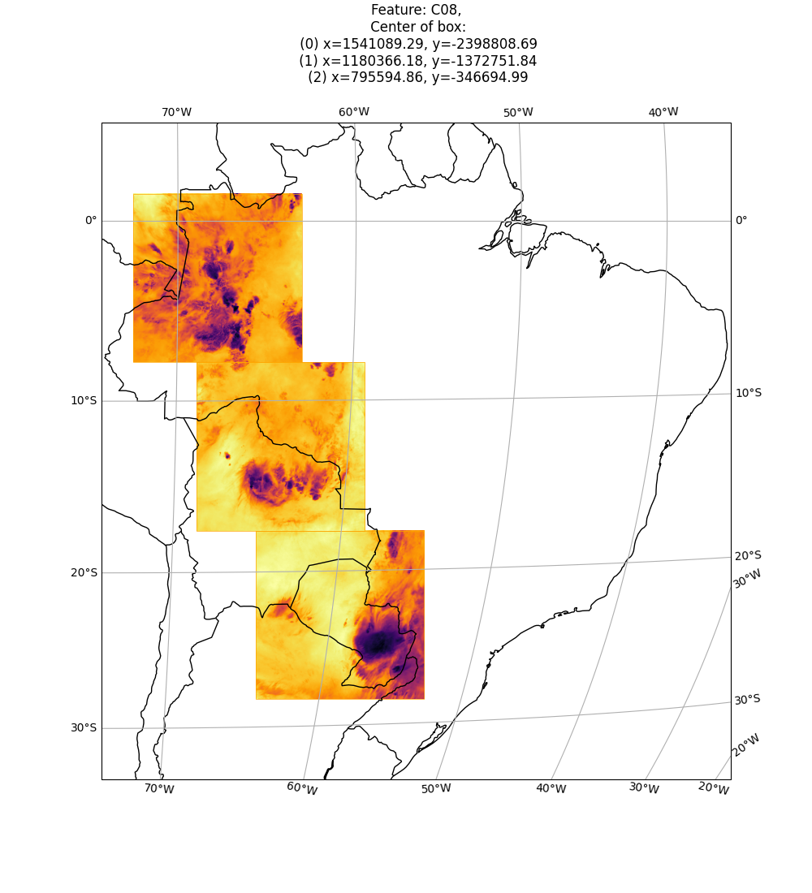
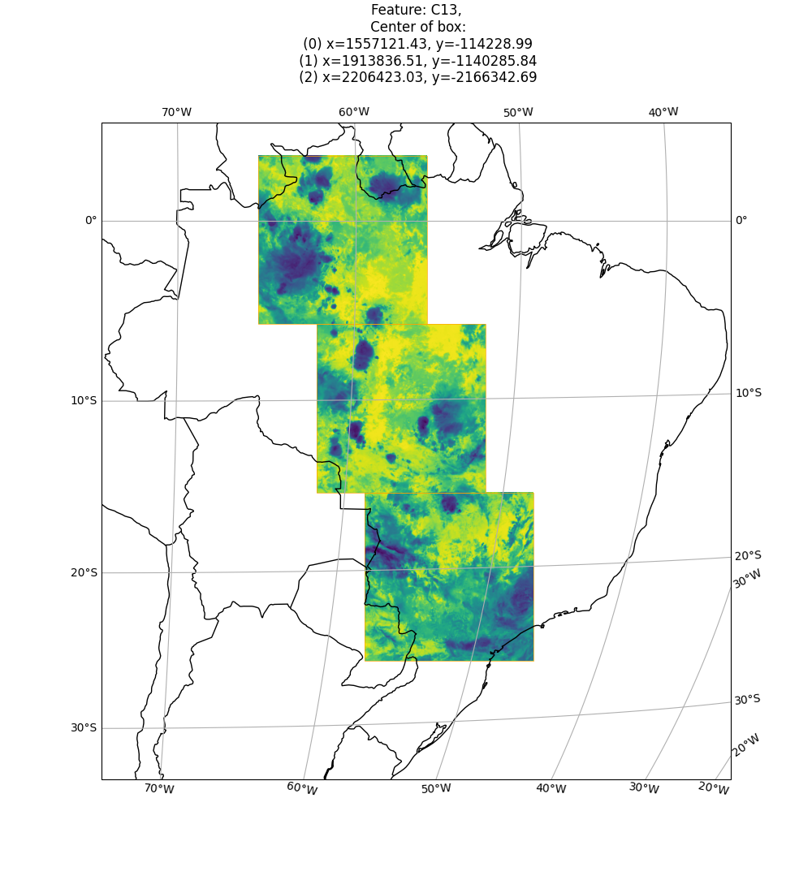
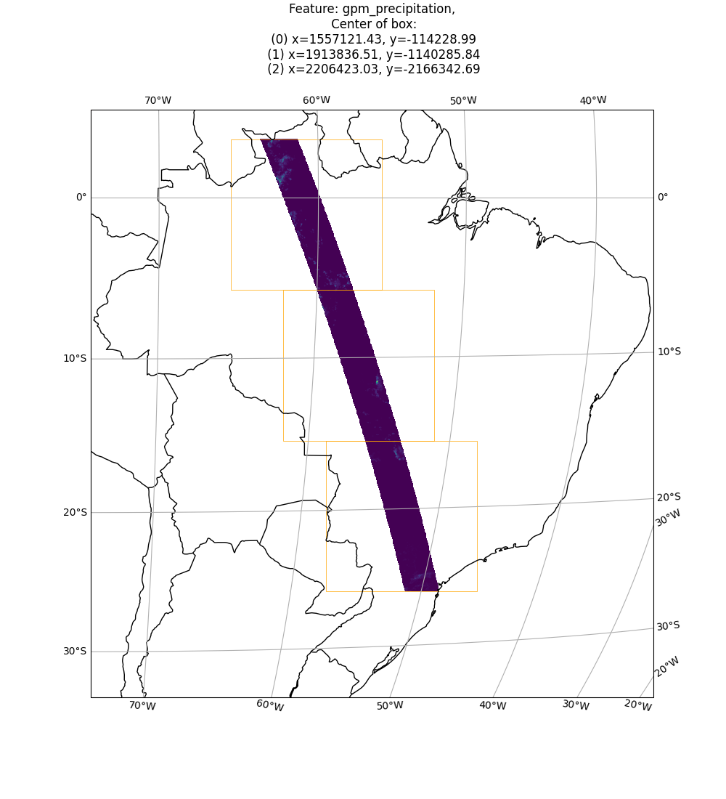

# Master's Thesis in Space, earth and environment
## Spring 2021

Downloading data for rain retrievals over Brazil.


### Workflow preprocessing
- Read link from linkfile and convert to start, end date
- Download gpm product for start, end date
- Transform gpm data into goes data coordinates
- Divide interesting data into NxN pixel boxes along swath
- Extract in, out time for gpm passing box region
- Download goes file matching box time
- Combine gpm and goes box data into Dataset


### Dataset storage format
```python
<xarray.Dataset>
Dimensions:            (x: 256, y: 256)
Dimensions without coordinates: x, y
Data variables:
    C08                (y, x) float32 216.2 217.3 218.0 ... 232.6 231.0 231.0
    C09                (y, x) float32 217.2 218.5 219.2 ... 240.5 236.9 236.8
    C10                (y, x) float32 217.6 218.9 219.8 ... 247.4 241.3 241.4
    C11                (y, x) float32 218.4 219.8 220.9 ... 260.4 251.2 253.3
    C13                (y, x) float32 218.9 220.1 220.9 ... 263.1 253.9 256.3
    C14                (y, x) float32 218.2 219.5 220.3 ... 260.5 250.1 251.7
    C15                (y, x) float32 217.5 218.8 219.6 ... 257.7 246.7 247.4
    C16                (y, x) float32 217.3 218.5 219.3 ... 252.0 242.8 242.8
    gpm_precipitation  (y, x) float32 nan nan nan nan nan ... nan nan nan nan
Attributes:
    ind_extent:      [1738 1877 1994 1621]
    area_extent:     [ 1533073.22533241 -2090190.03140092  2559130.07679672 -...
    shape:           [256 256]
    gpm_time_in:     2017-12-29 07:59:58.062000
    gpm_time_out:    2017-12-29 08:03:04.961999
    goes_time_in:    ['2017-12-29 08:00:45.500000', '2017-12-29 08:00:45.5000...
    goes_time_out:   ['2017-12-29 08:11:22.200000', '2017-12-29 08:11:22.8000...
    filename_gpm:    2B.GPM.DPRGMI.2HCSHv4-1.20171229-S064753-E082028.021790....
    filenames_goes:  ['OR_ABI-L1b-RadF-M3C08_G16_s20173630800455_e20173630811...
```
### 

<p float="left">



</p>


